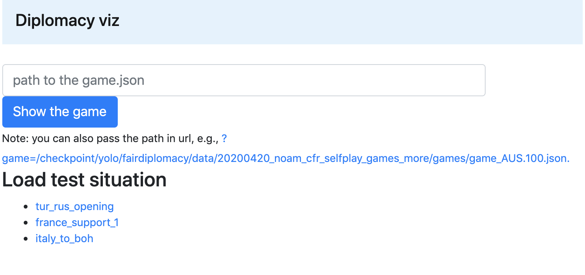

# Installation

Clone the repo with submodules:
```
git clone --recursive git@github.com:fairinternal/fairdiplomacy.git
cd fairdiplomacy
```

The following command will create/activate conda env with all needed modules:
```
. fair_activate.sh
```

Once that runs successfully, then install the module:
```
pip install -e .
```

# Training a Model

The model code is in [fairdiplomacy/models/dipnet/](fairdiplomacy/models/dipnet/). The model architecture is defined in [dipnet.py](fairdiplomacy/models/dipnet/dipnet.py)
We use config instead of argparse to run training and evaluation jobs. A config is a text proto message of type `MetaCfg` as defined in [conf/conf.proto](conf/conf.proto).
Specific configs are stored in [conf/](conf/) folder with [conf/common](conf/common) containing config chunks that could be included into other configs.

To run a config simply run:
```
python run.py --adhoc --cfg conf/c02_sup_train/sl.prototxt
```

This will start training of a supervised agent locally using config from [conf/c02_sup_train/sl.prototxt](conf/c02_sup_train/sl.prototxt).
To redefine any parameters in the config simply pass them via command line arguments using the following syntax: `<key>=<value>`. Example:
```
python run.py --adhoc --cfg conf/c02_sup_train/sl.prototxt batch_size=10
```

To run on cluster one has to set job params in `launcher.slurm`. The simplest way to do this is to use a predefined message. run.py allows to include any partial config into the main config using the following syntax: `I=<config_path>` or `I.<mount_point>=<config_path>`. In the latter case, the subconfig will be merged into the specified place of the root config. For instace, the following will include a launcher to run on cluster on a single node with 8 gpus (as defined in [conf/common/launcher/slurm_8gpus.prototxt](conf/common/launcher/slurm_8gpus.prototxt)):

```
python run.py --adhoc --cfg conf/c02_sup_train/sl.prototxt I.launcher=slurm_8gpus
```

One can combine includes and scalar redefines, e.g., to run the job on 2 machines:
```
python run.py --adhoc --cfg conf/c02_sup_train/sl.prototxt I.launcher=slurm_8gpus launcher.slurm.num_gpus=16
```

(Outdated. Re-write this script to use HeyHi?)
To train a model on the cluster, see the scripts in [slurm/](slurm/), specifically [example_train_sl.sh](slurm/example_train_sl.sh).


# Training exploit agent

Exploit agent learns to play against a fixed supervised agent. Configs for
exploit agents are in [conf/c04_exploit/](conf/c04_exploit/). Take the latest
and run:
```
python run.py --adhoc --cfg conf/c04_exploit/exploit_05.prototxt I.launcher=slurm_8gpus
```

The most important metric is `score/is_clear_win`, i.e., the win rate. It should be above 0.2 after half an hour minutes (12 epochs) and above 0.5 after an hour.


# Comparing Agents

Comparing agents is also executed via config. See [conf/c01_ag_cmp/cmp.prototxt](conf/c01_ag_cmp/cmp.prototxt) for an example config. The following will play Dipnet model vs 6 Mila bots:

```
python run.py --adhoc --cfg conf/c01_ag_cmp/cmp.prototxt
```

Some pre-defines agents are located in [conf/common/agents](conf/common/agents). You can plug them in into main config like this:
```
python run.py --adhoc --cfg conf/c01_ag_cmp/cmp.prototxt \
  I.agent_one=agents/random I.agent_six=agents/dipnet \
  power_one=ITALY
```

This will play random agent (playing Italy) against 6 dipnet agents, and writes the output to `output.json`

To run a full comparison suite on the cluster see [slurm/compare_agents.sh](slurm/compare_agents.sh)

# Config FAQ
(for argparse users)

## Nothing works
If you get error about failed import `conf.conf_pb2` or about missing fields in the config, run:
```
protoc conf/conf.proto --python_out ./
```

## How do I do `--help`
Go to `conf/conf.proto` and you'll see all flags with docs.

## Adding new flags
Just add them into the proto. The field id (number after "=") doesn't matter as we don't use binary format. Just increment the last one. Don't forget to run `protoc` after this.

## Running group runs


Sometimes you wants to do several runs, e.g., several training runs with different hyper parameters. One way to do this, is to run a bash script that will call `run.py` several time:
```(bash)
for lr in 0.1 0.001; do
  python run.py --cfg conf/c02_sup_train/sl.prototxt I.launcher=slurm_8gpus \
    lr=$lr
done
```

Note, there is no `--adhoc` flag. This means that the output folder will be a function of the config name and redefines. As a result, if such experiment is already running, run.py will not start a new one. So it's safe to run the script several times. Or add new values for `lr` in the script.


If you want to control the output path manully, you can do so:
```(bash)
for lr in 0.1 0.001; do
  python run.py --cfg conf/c02_sup_train/sl.prototxt I.launcher=slurm_8gpus \
    lr=$lr \
    --exp_id_pattern_override /checkpoint/$USER/custom_path/lr_${lr}
done
```

Alternative to bash is python, i.e. to make a call to run.py from `heyhi` module. The benefits of this approach is that one may check the status of the running (or died) jobs or get a mapping from experiment path to hyper parameter dict without having to reverse engineer the output folder.
Example of such approach could be found in [conf/c02_sup_train/rs_yolo_01_example.py](conf/c02_sup_train/rs_yolo_01_example.py). The script does launching and results aggregation with optional export to google-sheets.

Code walk through:

  * `yield_sweep` function yields pairs `(cfg_path, dict_with_redefines)` that has to be evaluated.
  * `get_logs_data` takes an experiment handle (a thing such that `handle.exp_path` is where outputs are) and returns dictionary of key metrics
  * `main`: launches runs from `yield_sweep` if there are not running already, goes through handles to collect slurm statuses (DEAD/RUNNING/DONE) of the jobs and current metrics (whatever `get_logs_data` extracts), prints the resulting DataFrame or import it google sheet.

To have google sheet support one has to install `pygsheets`. On the first run, the package will ask to open a link to authentify the heyhi app. Otherwise, you can dump the DataFrame on disk to explore it in a notebook or something else.

Scripts like this are expected to be treated as bash scripts, i.e., in read only mode (do not modify scripts after the experiment is done) and without too much includes. The scripts are expected to be submitted for documentation purposes.

Caveat: the scripts are expected to be run as modules in order for imports to work, e.g., `python -m conf.c02_sup_train.rs_yolo_01_example`.
If you have google-sheet export installed, you can add watch to export data there every 10m:
```
watch -n 600 "python -m conf.c02_sup_train.rs_yolo_01_example  2>&1 | tail -n3;   "
```

# Visualizing a Saved Game

The following allows to load a saved game on devfair and explore test situations.

Run:
```
pip install flask
nohup python -m fairdiplomacy.viz --port 8894 &
```

By default, this runs a webserver on `localhost:8994`.

If running on your devfair, be sure to run `ssh` with `-L 8894:localhost:8894`

Type the path to the game and press "Show the game".



# Playing Against a Bot

Run:
```
./bin/open_visualizer.py
```

By default, this runs a webserver on `localhost:3000` (and a websocket server on `localhost:8432`)

If running on your devfair, be sure to run `ssh` with `-L 3000:localhost:3000 -L 8432:localhost:8432`


Create a new standard game with 1 human user. Then run
```
python run.py --adhoc --cfg conf/c03_launch_bot/launch_bot.prototxt I.agent=agents/dipnet
```

To play against six CFR bots sharing two GPUs, run
```
python run.py --adhoc --cfg conf/c03_launch_bot/launch_bot.prototxt \
    I.agent=agents/cfr1p \
    agent.cfr1p.postman_sync_batches=False \
    reuse_model_servers=2
```

# A Primer on the Game object

`game.get_state()` returns a dict containing the current board position. The most commonly accessed keys are:

`name`, returning the short-hand game phase:
```
>>> game.get_state()["name"]
'S1901M'
```

`units`, returning the locations of all units on the board:
```
>>> game.get_state()["units"]
{'AUSTRIA': ['A BUD', 'A VIE', 'F TRI'],
 'ENGLAND': ['F EDI', 'F LON', 'A LVP'],
 'FRANCE': ['F BRE', 'A MAR', 'A PAR'],
 'GERMANY': ['F KIE', 'A BER', 'A MUN'],
 'ITALY': ['F NAP', 'A ROM', 'A VEN'],
 'RUSSIA': ['A WAR', 'A MOS', 'F SEV', 'F STP/SC'],
 'TURKEY': ['F ANK', 'A CON', 'A SMY']}
```

`centers`, returning the supply centers controlled by each power:
```
>>> game.get_state()["centers"]
{'AUSTRIA': ['BUD', 'TRI', 'VIE'],
 'ENGLAND': ['EDI', 'LON', 'LVP'],
 'FRANCE': ['BRE', 'MAR', 'PAR'],
 'GERMANY': ['BER', 'KIE', 'MUN'],
 'ITALY': ['NAP', 'ROM', 'VEN'],
 'RUSSIA': ['MOS', 'SEV', 'STP', 'WAR'],
 'TURKEY': ['ANK', 'CON', 'SMY']}
```

`game.order_history` is a SortedDict of {short phase name => {power => [orders]}}
```
>>> game.order_history
{'S1901M': {'AUSTRIA': ['A VIE - GAL', 'F TRI H', 'A BUD - RUM'],
            'ENGLAND': ['F EDI - NTH', 'A LVP - YOR', 'F LON - ENG'],
            'FRANCE': ['F BRE - MAO', 'A PAR - BUR', 'A MAR S A PAR - BUR'],
            'GERMANY': ['F KIE - HOL', 'A BER - KIE', 'A MUN - BUR'],
            'ITALY': ['A VEN - PIE', 'A ROM - VEN', 'F NAP - ION'],
            'RUSSIA': ['A MOS - UKR',
                       'F STP/SC - BOT',
                       'A WAR - GAL',
                       'F SEV - BLA'],
            'TURKEY': ['A SMY - ARM', 'F ANK - BLA', 'A CON - BUL']},
 'F1901M': {'AUSTRIA': ['A VIE - GAL', 'F TRI H', 'A RUM S A ARM - SEV'],
 ...
```

`game.get_all_possible_orders()` returns a dict from location -> list of possible orders, e.g.
```
>>> game.get_all_possible_orders()
{'ADR': [],
 'AEG': [],
 'ALB': [],
 'ANK': ['F ANK S F SEV - ARM',
         'F ANK H',
         'F ANK S A CON',
         'F ANK - ARM',
         'F ANK S A SMY - CON',
         'F ANK S F SEV - BLA',
         'F ANK S A SMY - ARM',
         'F ANK - BLA',
         'F ANK - CON'],
  ...
```

`game.get_orderable_locations()` returns a map from power -> list of locations that need an order:
```
>>> game.get_orderable_locations()
{'AUSTRIA': ['BUD', 'TRI', 'VIE'],
 'ENGLAND': ['EDI', 'LON', 'LVP'],
 'FRANCE': ['BRE', 'MAR', 'PAR'],
 'GERMANY': ['BER', 'KIE', 'MUN'],
 'ITALY': ['NAP', 'ROM', 'VEN'],
 'RUSSIA': ['MOS', 'SEV', 'STP', 'WAR'],
 'TURKEY': ['ANK', 'CON', 'SMY']}
```

`game.set_orders(power, orders_list)` sets orders for that power's units, e.g.
```
>>> game.set_orders("TURKEY", ["F ANK - BLA", "A CON H"])
```

`game.process()` processes the orders that have been set, and moves to the next phase


Complete documentation is available [here](https://docs.diplomacy.ai/en/stable/api/diplomacy.engine.game.html)
