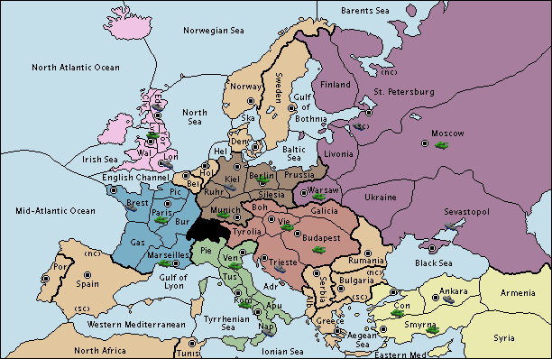

# Diplomacy SearchBot

This code accompanies the paper ["Human-Level Performance in No-Press Diplomacy via Equilibrium Search"](https://openreview.net/forum?id=0-uUGPbIjD).

A very brief orientation:
- The implementation for SearchBot lives [here](fairdiplomacy/agents/searchbot_agent.py)
- The supervised learning model architecture lives [here](fairdiplomacy/models/diplomacy_model/diplomacy_model.py), and the bulk of the training logic lives [here](fairdiplomacy/models/diplomacy_model/train_sl.py)
- The pretrained blueprint model is available for download under this repo's "Releases"
- The command to play one game with 1 SearchBot vs. 6 Blueprint bots is:

```
python run.py --adhoc --cfg c01_ag_cmp/cmp.prototxt \
    I.agent_one=agents/searchbot.prototxt \
    I.agent_six=agents/model_sampled \
    agent_one.model_path=/path/to/model \
    agent_six.model_path=/path/to/model
```

For more info about the configuration and command-line args, see the [Running Tasks](#running-tasks) section below.

## Game info
Diplomacy is a strategic board game set in 1914 Europe.
The board is divided into fifty-six land regions and nineteen sea regions.
Forty-two of the land regions are divided among the seven Great Powers of the game: Austria-Hungary, England, France, Germany, Italy, Russia, and Turkey.
The remaining fourteen land regions are neutral at the start of the game.

Each power controls some regions and some units.
The number of the units controlled depends on the number of the controlled key regions called Supply Centers (SCs).
Simply put, more SCs means more units.
The goal of the game is to control more than half of all SCs by moving units into these regions and convincing other players to support you.

You can find the full rules [here](https://en.wikibooks.org/wiki/Diplomacy/Rules).
To get the game's spirit, watch some [games with comments](https://www.youtube.com/watch?v=k04DTyEBeWw).
What's more, you can play the game online on [WebDiplomacy](https://webdiplomacy.net/) either against bots or humans.

<p align="center">

</p>


## Installation

```
# Clone the repo with submodules:

git clone --recursive git@github.com:facebookresearch/diplomacy_searchbot.git
cd diplomacy_searchbot

# Apt installs
apt-get install -y wget bzip2 ca-certificates curl git build-essential clang-format-8 git wget cmake build-essential autoconf libtool pkg-config libgoogle-glog-dev

# Install conda
wget --quiet https://repo.anaconda.com/miniconda/Miniconda3-4.7.10-Linux-x86_64.sh -O ~/miniconda.sh
/bin/bash ~/miniconda.sh -b

# Create conda env
conda create --yes -n diplomacy python=3.7
source activate diplomacy

# Install pytorch
conda install --yes pytorch=1.7.1 torchvision cudatoolkit=11.0 -c pytorch

# Install go for boringssl in grpc
conda install go protobuf --yes

# Install python requirements
pip install -r requirements.txt

# Local pip installs
pip install -e ./thirdparty/github/fairinternal/postman/nest/
pip install -e ./thirdparty/github/fairinternal/postman/postman/
pip install -e . -vv

# Make
make

# Run unit tests
make test_fast
```

After each pull it's recommended to run `make` to re-compile internal C++ and protobuf code. In case of missing dependencies, run `make deps` to install all dependencies.

### Running tasks

The code has a single entry point, `run.py`, that can be used to train a model, compare agents, profile them, etc.
We refer to this kind of activity as a task.
To specify which task to run and what parameters to use, we use configs.
Below an example of a config that is used to train an agent with imitation learning on human data:

```
train {
    dataset_params: {
        data_dir: "/checkpoint/alerer/fairdiplomacy/facebook_notext/games"
        value_decay_alpha: 0.9;
    }
    batch_size: 2500;
    lr: 0.001;
    lr_decay: 0.99;
    clip_grad_norm: 0.5
    checkpoint: "./checkpoint.pth";
    lstm_dropout: 0.1;
    encoder_dropout: 0.2;
    num_encoder_blocks: 8;
}
```

We use text [protobuf](https://developers.google.com/protocol-buffers/docs/proto#simple) format to specify the configs.
Each task has a schema, a formal description of what parameters are allowed in each config, e.g., [here's the definition](conf/conf.proto#L119-L264) for the train task above.

Protobufs could be confusing, but good news - you don't have to understand them to run tasks.
Instead, you need to find the config for your task and run it.
We describe all tasks in the next section.
Here is an example of how to launch training on human data:

```
python run.py --adhoc --cfg conf/c02_sup_train/sl.prototxt
```

You can override any config parameter in command line using argparse-like syntax:

```
python run.py --adhoc --cfg conf/c02_sup_train/sl.prototxt batch_size=200 --dataset_params.value_decay_alpha=1.0
```

Note that it's optional to use "--" in front of overrides.

Check documentation for [HeyHi](heyhi/), the configuration library, for more details.


### Tasks overview

In general, all configs are stored in [conf/](conf/) folder and grouped by tasks.
You can find all possible arguments for all tasks in [conf/conf.proto](conf/conf.proto) file.
Below are the most important tasks:

 * Supervised training task. Configs in `c02_sup_train`, docs [here](docs/train_sup.md).
 * Making 2 agents play against each other for evaluation. Configs in `c01_ag_cmp`, docs [here](docs/compare_agents.md).
 * Training RL agent. Configs in `c04_exploit`, docs [here](docs/selfplay.md).

## Going deeper

We use an in-house fast C++ implementation of the diplomacy environment.
See [here](dipcc/README.md) for how to interact with it.

The games could be serialized as JSON files, e.g., our human data and test situations use this format.

Code structure:

 * [fairdiplomacy](fairdiplomacy/) - datasets, agents, and trainers
 * [conf](conf/) - all the configs for fairdiplomacy/ part.


External links:

 * ["No Press Diplomacy: Modeling Multi-Agent Gameplay" (Paquette et al, 2019)](https://papers.nips.cc/paper/8697-no-press-diplomacy-modeling-multi-agent-gameplay.pdf), on which our supervised learning is based.
 * ["Learning to Play No-Press Diplomacy with Best Response Policy Iteration" (Anthony et al, 2020)](https://arxiv.org/pdf/2006.04635.pdf). We use some model improvement from the paper.


### Pre-commit hooks

Run `pre-commit install` to install pre-commit hooks that will auto-format python code before commiting it.

Or you can do this manually. Use [black](https://github.com/psf/black) auto-formatter to format all python code.
For protobufs use `clang-format-8 conf/*.proto -i`.
Circle CI tests check for that.

### Tests

To run tests locally run `make test`. Or you can wait Circle CI to run the test once you push your changes to any brunch.

We have 2 level of tests: fast, unit tests (run with `make test_fast`) and slow, integration tests (run with `make test_integration`).
The latter aim to use the same entry point as users do, i.e., `run.py`

There are some differences between running the tests locally vs on CI.

 1. Most integration tests use small fake data in the repo, but some use real data to check that the latest models are working.
Obviuously, these tests are skipped on CI and so local tests have better coverage.
  2. CI use CPUs for everything.

We use `nose` to discover tests.
It searches for `*test*.py` files and extracts all unittests from them. So usually your tests will be automatically included into CircleCI.

Some useful commands. Integration tests are notoriously slow and so sometimes one want to execute only one particular test. Here's how to do this. First, list all the test:

```
$ nosetests integration_tests/integration_test.py --collect-only -v --with-id
#2 integration_test.test_build_cache ... ok
#3 integration_test.test_rl_configs('exploit_06.prototxt', {}) ... ok
#3 integration_test.test_rl_configs('selfplay_01.prototxt', {}) ... ok
#4 integration_test.test_rl_configs_real_data('exploit_06.prototxt', {}) ... ok
#4 integration_test.test_rl_configs_real_data('selfplay_01.prototxt', {}) ... ok
#5 integration_test.test_train_configs('sl.prototxt', {}) ... ok
...
```

And then pass the id of the test to the nose:

```
nosetests integration_tests/integration_test.py  -v --with-id 3
```

## License

```
MIT License

Copyright (c) Facebook, Inc. and its affiliates.

Permission is hereby granted, free of charge, to any person obtaining a copy
of this software and associated documentation files (the "Software"), to deal
in the Software without restriction, including without limitation the rights
to use, copy, modify, merge, publish, distribute, sublicense, and/or sell
copies of the Software, and to permit persons to whom the Software is
furnished to do so, subject to the following conditions:

The above copyright notice and this permission notice shall be included in all
copies or substantial portions of the Software.

THE SOFTWARE IS PROVIDED "AS IS", WITHOUT WARRANTY OF ANY KIND, EXPRESS OR
IMPLIED, INCLUDING BUT NOT LIMITED TO THE WARRANTIES OF MERCHANTABILITY,
FITNESS FOR A PARTICULAR PURPOSE AND NONINFRINGEMENT. IN NO EVENT SHALL THE
AUTHORS OR COPYRIGHT HOLDERS BE LIABLE FOR ANY CLAIM, DAMAGES OR OTHER
LIABILITY, WHETHER IN AN ACTION OF CONTRACT, TORT OR OTHERWISE, ARISING FROM,
OUT OF OR IN CONNECTION WITH THE SOFTWARE OR THE USE OR OTHER DEALINGS IN THE
SOFTWARE.
```
