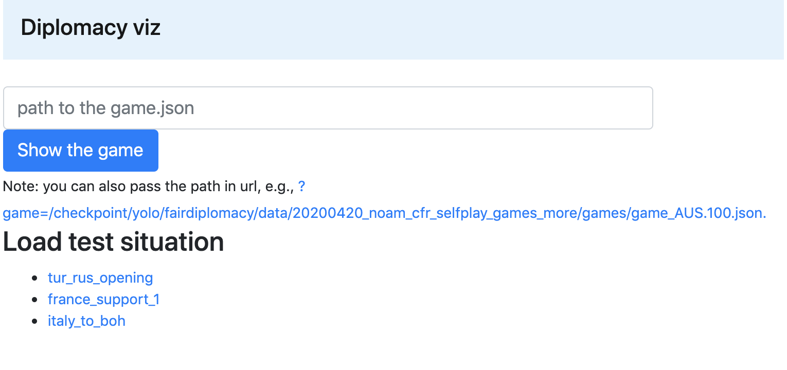

# Visualizing a Saved Game

The following allows to load a saved game on devfair and explore test situations.

Run:
```
pip install flask
nohup python -m fairdiplomacy.viz --port 8894 &
```

By default, this runs a webserver on `localhost:8994`.

If running on your devfair, be sure to run `ssh` with `-L 8894:localhost:8894`

Type the path to the game and press "Show the game".

