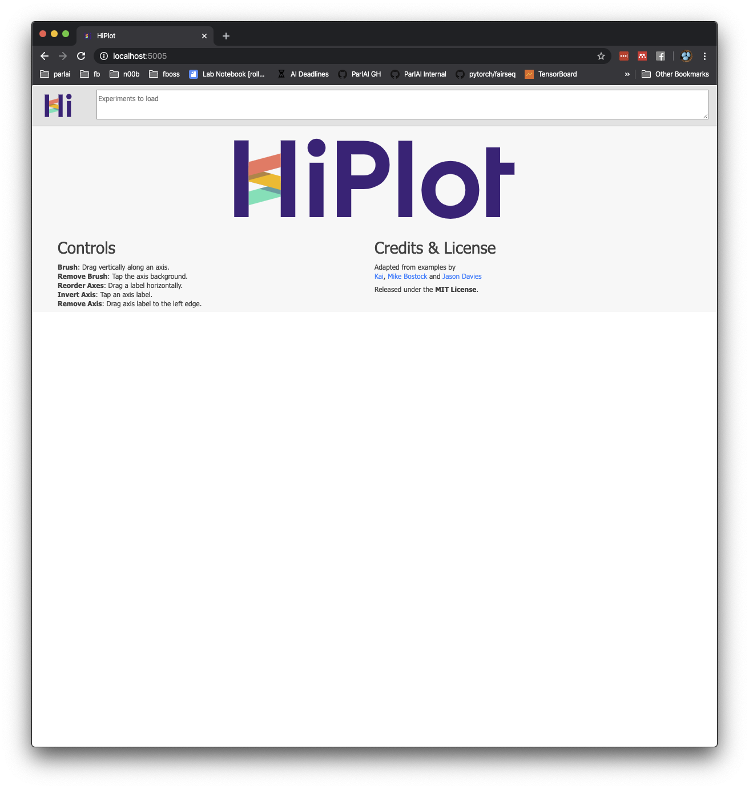
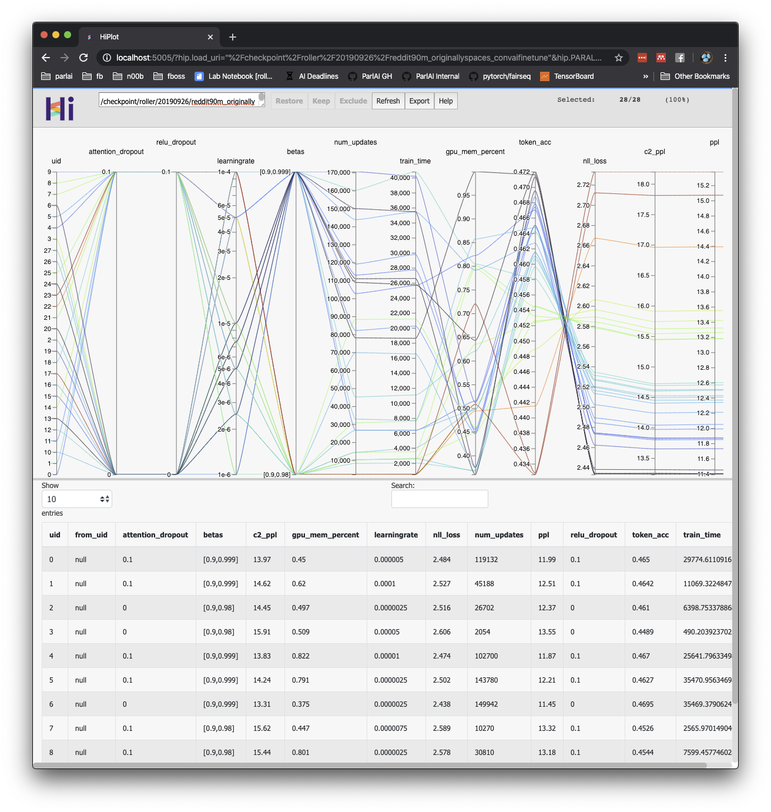

# Param Sweep Utilities

**This is copy-pasted from the parlai_internal repository!**

These are our secret sauce for running hyperparameter sweeps.

Examples are the best way to understand usage of param sweep.

## Using copy_env is very slow

You probably have thousands of extra files in your parlai or parlai_internal folder
that are not related to the actual code base. Copying many files is very slow in NFS,
typically performing much worse than copying one very file. Try to ensure these extra
files are not in your parlai folder if they do not need to be.

## Running HiPlot

in your ParlAI folder, run

```bash
$ python parlai_diplomacy/utils/param_sweeps/param_sweep_plot.py
 * Serving Flask app "hiplot.server" (lazy loading)
 * Environment: production
   WARNING: This is a development server. Do not use it in a production deployment.
   Use a production WSGI server instead.
 * Debug mode: off
 * Running on http://127.0.0.1:5005/ (Press CTRL+C to quit)
```

You'll need to have port fowarding of port 5005 set up. See the
[fair wiki](https://our.internmc.facebook.com/intern/wiki/FAIR/Platforms/FAIRClusters/FAIRClusterFAQ/#how-do-i-use-visdom-thou)
for an example of how do that.

Then open your browser and go to `http://localhost:5000/`. You should see a UI asking
for a sweep example:



Paste in a folder pointing to the root of your sweep, and press enter. For example,

`/checkpoint/roller/20190926/reddit90m_originallyspaces_convaifinetune`




